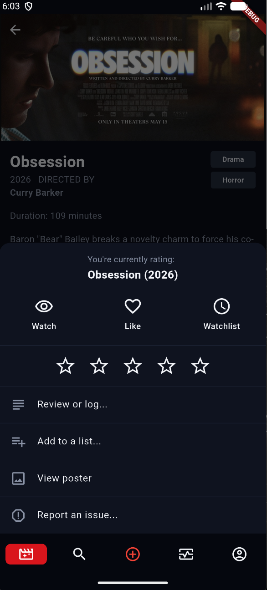

# Flix

**English below — [skoči na englesku verziju](#english) / [jump to the English version](#english)**

Platforma za katalog filmova: ASP.NET Core API, Flutter desktop klijent
za administraciju kataloga, Flutter mobilni klijent za pregled filmova, ocjenjivanje, vođenje
dnevnika i pravljenje lista, i RabbitMQ pretplatnik koji šalje mail o zahtjevima za filmove.

## Struktura repozitorija

| Putanja | Šta sadrži |
| --- | --- |
| `Flix.Backend/` | ASP.NET Core 10 Web API na SQL Serveru, slike u Azure Blob Storage-u. Četiri slojevita projekta: `Flix.Model` → `Flix.CommonServices` → `Flix.Services` → `Flix.WebApi`. |
| `Flix.Backend/Flix.Subscriber/` | Konzolni RabbitMQ pretplatnik koji šalje mail o zahtjevima za filmove i o resetu lozinke. Stoji izvan sloja API-ja i dijeli s njim samo `Flix.Model` i `Flix.Services`. |
| `Flix.Backend/Flix.Services.Tests/` | xUnit testovi sistema preporuke. |
| `Flix.UI/flix_desktop/` | Flutter desktop admin klijent — filmovi, glumci, korisnici, recenzije i clashevi uz potpuni CRUD, red zahtjeva za filmove, prijave i statistika sa PDF izvještajima. |
| `Flix.UI/flix_mobile/` | Flutter mobilni klijent — feedovi na početnoj, pretraga, detalji filma, profil i postavke naloga, dnevnik, watchlist, liste, praćenje i blokiranje korisnika, zahtjevi za filmove, prijave grešaka u katalogu, prijave korisnika, reset lozinke i lista notifikacija preko SignalR-a. |
| `Flix.Backend/docker-compose.yml` | SQL Server + RabbitMQ + API + pretplatnik; `Dockerfile` stoji uz njega, a pretplatnikov u `Flix.Subscriber/`. |

## Pokretanje

### Sve u Dockeru

Prvo raspakovati `Flix.Backend/.env.zip`, u njemu je gotov `.env` sa svim ključevima i
vrijednostima. Arhiva je zaštićena lozinkom koja je priložena uz GitHub Release na
DLWMS-u, pa traži 7-Zip ili WinRAR; ugrađeno raspakivanje u Windows Exploreru i
`Expand-Archive` u PowerShell-u ne znaju za šifrovane arhive. Environment file mora završiti u
`Flix.Backend/`, uz `docker-compose.yml`, jer ga pretplatnik traži kao obavezan
(`required: true`) i bez njega se compose neće ni podići.

Compose fajl i `Dockerfile` stoje u istom folderu, pa se pokreće odatle:

```powershell
cd Flix.Backend
& "C:\Program Files\7-Zip\7z.exe" x .env.zip -p<lozinka>   # ili desni klik → 7-Zip → Extract Here
docker compose up -d --build
```

Time se podižu četiri servisa: SQL Server na `localhost:1433` (`sa` / `YourStrong!Passw0rd1`),
RabbitMQ na `localhost:5672` sa management UI-jem na [localhost:15672](http://localhost:15672)
(`admin` / `admin`), API na `http://localhost:5071` i `flix-subscriber`, koji nema port jer
samo sluša red poruka. API čeka SQL Serverov healthcheck i sam primjenjuje migracije pri
pokretanju, pa se na svježem volumenu baza podiže već popunjena.

Za pokretanje samo baze i RabbitMQ-a, kada se API pokreće iz IDE-a:

```powershell
docker compose up -d sqlserver rabbitmq
```

### Konfiguracija

Sve što je tajna ili ovisi o mašini stoji u `Flix.Backend/.env`; `appsettings.json` ne nosi ni
jedan connection string ni JWT ključ. Environment file je u gitignore-u i uz to `.dockerignore`-om
izbačen iz docker image-a, pa u repozitoriju putuje kao `.env.zip`, a u kontejner ulazi kroz `env_file`.

| Ključ | Za šta |
| --- | --- |
| `BLOB_STORAGE_CONNECTION_STRING` | Azure Blob Storage. Bez njega pada svaki odgovor koji nosi URL slike. |
| `DATABASE_CONNECTION` | SQL Server. |
| `RABBITMQ_HOST` / `_USER` / `_PASS` | Broker, i za API i za pretplatnika. |
| `JWT_ISSUER`, `JWT_AUDIENCE`, `SECRET_KEY`, `JWT_DURATION` | Potpisivanje tokena. |
| `CORS_ORIGINS` | Lista dozvoljenih origina razdvojena `;`. Opciono; bez nje se koriste `http://localhost:5071` i `https://localhost:7140`. |
| `SMTP_HOST` / `_PORT` / `_USER` / `_PASS` / `_FROM` / `_FROM_NAME` | Relej kroz koji pretplatnik šalje mail. |
| `ADMIN_EMAIL`, `ADMIN_NAME` | Rezervni primalac, samo kada je baza nedostupna. |
| `MSSQL_SA_PASSWORD`, `MSSQL_DB` | Čita ih `docker-compose.yml` kada gradi connection stringove kontejnera, ne aplikacije. |

`Program.cs` učitava `.env` penjući se uz stablo direktorija, pa isti fajl radi i kada se
pokreće iz `Flix.WebApi/`, i prevodi te ključeve u `ConnectionStrings:*` i `JwtToken:*` koje
ostatak koda čita. Vrijednosti koje postavi Docker imaju prednost, jer bi unutar kontejnera
`localhost` iz `.env`-a pokazivao na pogrešnu mašinu.

### API iz IDE-a

```powershell
dotnet run --project Flix.Backend/Flix.WebApi --launch-profile https   # https://localhost:7140
dotnet dev-certs https --trust
```

U Development okruženju API se sam dokumentuje na `/scalar`, a OpenAPI dokument stoji na
`/openapi/v1.json`.

### Pretplatnik iz IDE-a

```powershell
dotnet run --project Flix.Backend/Flix.Subscriber
```

Traži isti `.env`, a bez `DATABASE_CONNECTION`-a se ne gasi — samo pada na `ADMIN_EMAIL`
umjesto na spisak admina iz baze.

### Flutter klijenti

```powershell
flutter pub get
dart run build_runner build --delete-conflicting-outputs
flutter run -d windows          # desktop
flutter run                     # mobilni, na emulatoru ili uređaju
```

`*.g.dart` je u gitignore-u, pa `build_runner` nije opcionalan na svježem klonu — nijedan
klijent se bez njega ne kompajlira.

Bazni URL API-ja je konstanta koja se postavlja pri kompajliranju: desktop klijent
podrazumijeva `http://localhost:5071/`, a mobilni `http://10.0.2.2:5071/` (put Android
emulatora do host mašine). Za pokretanje na stvarnom uređaju proslijediti
`flutter run --dart-define=API_BASE_URL=http://192.168.1.10:5071/`. U oba klijenta `AuthProvider`
čita isti define i na njega dodaje `/Access`, pa se s njim pomjera i login.

### Nalozi iz seed podataka

| Korisničko ime | Lozinka | Uloga |
| --- | --- | --- |
| `adin.jamakovic` | `Admin123!` | Admin |
| `emmaclarke` | `Test123!` | User |

Desktop klijent je samo za administratore — čita role claim iz JWT-a i odbija sve ostale već na
login ekranu.

### Istek tokena

Pristupni token traje `JWT_DURATION` minuta, pa istekne usred rada. Oba klijenta zato svaki zahtjev
šalju kroz `BaseProvider._request`: na HTTP 401 se jednom pozove `POST /Access/LoginWithRefreshToken`
i zahtjev se ponovi s novim tokenom, tako da korisnik ništa ne primijeti. Zahtjev se šalje kao
closure jer ponovljeni poziv mora nositi novi token, a `MultipartRequest` se gradi iznova — jednom
poslan se ne može ponoviti. Više paralelnih 401 odgovora dijeli isti poziv osvježavanja, pa se
sesija ne obnavlja više puta odjednom.

Ako i osvježavanje padne (refresh token istekao, poništen odjavom ili nalog deaktiviran), sesija se
briše i klijent vodi na login ekran — mobilni kroz root navigator, jer istek može pogoditi bilo koji
tab, uz poruku da se treba ponovo prijaviti. Istekli token se nigdje ne ignoriše.

### Odjava

`POST /Access/Logout` briše iz baze sve refresh tokene naloga koji ga je pozvao, pa se sesija ne
može produžiti — sljedeći `LoginWithRefreshToken` vraća `Refresh token not found`, a nastavak rada
traži ponovni login.

Pristupni token nije u bazi i namjerno tu ne završava: JWT se provjerava potpisom, bez upita nad
bazom. Odjava ga zato ne poništava odmah — ostaje važeći do isteka `JWT_DURATION` minuta (trenutno
15), i toliki je prozor u kojem bi kopija tokena još radila. Poništavanje i njega tražilo bi ili
crnu listu ili čuvanje pristupnih tokena u bazi i upit pri svakom zahtjevu; nijedno nije urađeno,
pa se odjava oslanja na kratak vijek tokena.

Oba klijenta zovu endpoint prije nego što očiste svoja polja — desktop iz dugmeta u zaglavlju,
mobilni iz *Settings → Log out*. Poziv koji padne (istekao token, nedostupan API) ne zadržava
korisnika prijavljenim, jer se lokalna sesija briše svakako.

## Recenzije, dnevnik i ponovna gledanja

Sve što korisnik zabilježi o filmu — ocjenu, lajk, napisanu recenziju, gledanje — jeste red u
tabeli **`Reviews`**. Dvije vrste redova razdvaja flag `IsDiaryEntry`, i ta razlika je ono što
treba razumjeti prije diranja ovog dijela aplikacije.



Obje vrste se upisuju sa ekrana detalja filma. Dugme
`"Rate, log, review, add to list + more"` otvara action sheet sa slike
(`screens/movie_details/actions_sheet.dart`), a odatle:

**Toggleovi i zvjezdice mijenjaju trenutni stav korisnika** (`IsDiaryEntry = false`). *Watch*,
*Like* i ocjena zvjezdicama ažuriraju jedan jedini red po korisniku i filmu, na mjestu.
Ponovno ocjenjivanje filma zamjenjuje prethodnu ocjenu; ne dodaje ništa novo. Iz tog reda se
čita stanje "ovo si već ocijenio" na ekranu detalja — a kada trajne recenzije nema, jer je
prerasla u zapis, čita se iz posljednjeg zapisa u dnevniku. Tako korisnika po filmu uvijek
predstavlja tačno jedan red, i tim redom upravljaju i zvjezdice i forma za bilježenje.

**"Review or log…" upisuje zapis u dnevnik** (`IsDiaryEntry = true`). Otvara formu za tekst
recenzije i datum gledanja filma; potvrda dodaje novi red. Korisnik isti film može zabilježiti
proizvoljan broj puta — svaki zapis je jedno gledanje, a svaki nakon prvog je ponovno gledanje
(`IsRewatch`). To je jedini način da se dobije više od jedne recenzije istog filma, zbog čega
se dnevnik čita kao hronologija, a ne kao spisak mišljenja.

Zapis ne dodaje uvijek novi red. Ako film već ima trajnu recenziju — korisnik ga je ocijenio
zvjezdicama, ali ga još nije zabilježio — taj red **postaje** zapis (`IsDiaryEntry` prelazi na
`true`, uz tekst i datum). Ocjena data u sheetu je početak iste recenzije, a ne druge, pa iza
ocjenjivanja i bilježenja stoji jedan red. Tek ponovno gledanje dodaje novi, zbog čega drugi
red uvijek znači i drugo gledanje.

**"Watchlist" uopšte nije recenzija.** Dodaje `MovieListItems` red u korisnikovu watchlistu, uz
ostale njegove liste.

`GET /Diary` vraća samo `IsDiaryEntry` redove jednog korisnika, poredane po danu gledanja.
`GET /Review` je opšti upit nad istom tabelom i vraća obje vrste, jer je recenzija sa tekstom
uvijek zapis u dnevniku — lista recenzija filma i admin feed bi inače bili prazni. Ko treba samo
jednu vrstu, traži je: `IsDiaryEntry=false` su trajne recenzije iza ocjena, `IsDiaryEntry=true`
zapisi.

Brisanje je podijeljeno isto tako. `DELETE /Diary/{id}` traži uz id zapisa i id pozivaoca, pa
korisnik povlači gledanje koje je sam zabilježio, a ne tuđe; `DELETE /Review/{id}` ostaje
admin endpoint za moderaciju. Oba brišu aktivnosti koje pokazuju na red i vraćaju filmu
pregled. Na tu akciju upućuje i trajna recenzija: skidanje *Watch*-a sa filma koji ima zapise
se odbija, jer je zapis zabilježeno gledanje i napisana recenzija, a ni jedno ni drugo toggle
ne baca — prvo idu zapisi.

Ta razlika pokreće i preporuke. `IRecommendationSignalService` skuplja recenzije, stavke
watchliste i aktivnosti gledanja u jedan `UserMovieSignal` po korisniku i filmu, gdje su
naklonost i to da je film odgledan nezavisni: recenzija od jedne zvjezdice je odgledan film bez
naklonosti, a dodavanje na watchlistu je naklonost prema filmu koji još nije pogledan.

### Trenutno stanje

Tok je povezan s kraja na kraj. Toggleovi i zvjezdice pišu kroz
`POST /Review/StandingReview`, a `GET /Review/MovieState` vraća stanje na kojem se sheet
otvara — odgledano, lajk, ocjena, watchlista i broj zapisa u dnevniku. *Review or log…*
otvara formu (`screens/movie_details/log_form.dart`) koja piše na `POST /Diary`; `Review`
sada nosi `WatchedOn`, pa se dnevnik sortira po danu gledanja, a ne po vremenu upisa.
`IsRewatch` odlučuje server, jer je svaki zapis nakon prvog gledanja ponovno gledanje.
*Watchlist* ide na `POST /List/AddToList` i `DELETE /List/Watchlist/{movieId}`, i zapis u
dnevnik sam skida film sa watchliste.

Zapis piše i aktivnosti, a ne samo red u `Reviews`: `WatchedMovie` uvijek, `ReviewedMovie` kada
zapis nosi tekst i `LikedMovie` kada nosi lajk. Svaka od njih se po recenziji upisuje najviše
jednom, pa dopunjavanje istog zapisa tekstom ili lajkom dodaje aktivnost koja je falila, a ne
duplikat one koja već stoji.

*Add to a list…* otvara sheet sa korisnikovim custom listama
(`screens/movie_details/add_to_list_sheet.dart`) — watchlista se tu ne bira jer je toggle
iznad, a clash liste pripadaju clashu. Dodavanje ide na `POST /List/AddToList`, koji je
zamijenio raniji `POST /List/Watchlist/{movieId}`: jedan zahtjev pokriva obje destinacije, gdje
`ListId` nosi samo custom lista, watchlista se razrješava iz tokena i jedina piše aktivnost.
Custom lista odbija duplikat, dok ga watchlista tiho ignoriše.

*Report an issue…* otvara formu (`screens/movie_details/report_issue.dart`) — padajuća lista
tipičnih grešaka u katalogu plus opis, koji je obavezan samo uz *Other*, jer je tada jedino
što adminu govori šta da ispravi. Prijava ide na `POST /MovieIssueReport` kao `Open`;
`MovieIssueReportService` sam upisuje prijavitelja iz tokena, a `GetDataSource` onome ko nije
admin vraća samo njegove prijave, pa i listanje i izmjena i brisanje ostaju u okviru vlastitih.
Vlasnik svoju prijavu može mijenjati samo dok je otvorena; admin je zatvara `PUT`-om sa
statusom i komentarom, čime se bilježi ko ju je i kada riješio.

Poslane prijave korisnik čita u *Settings → My movie reports*
(`screens/user_profile/my_issue_reports.dart`) — spisak sa statusom, adminovim komentarom i
datumom rješavanja, samo za čitanje. Admin ih zatvara sa ekrana *Issues* na desktopu.

## Liste

Liste se prave i uređuju na jednom ekranu (`screens/user_profile/list_form.dart`): naziv,
opcioni opis i pretraga filmova sa debounceom, gdje se odabrani filmovi drže u listi koja se
šalje kao `movieIds`. Isti ekran otvara i `POST /List` i `PUT /List/{id}`, ovisno o tome da li
je dobio listu, a nudi i brisanje (`DELETE /List/{id}`, uz potvrdu, jer sa listom odlazi i
clash u koji je prijavljena). Popuna liste nije obavezna — film se kasnije dodaje sa *Add to a
list…* na detaljima filma.

Uređivanje je vezano za vlasništvo, ne za ekran: na svom profilu tap na listu otvara formu, a
na tuđem `screens/user_profile/list_details.dart`, koji istu listu prikazuje samo za čitanje.
Novonapravljena lista upisuje `CreatedList` aktivnost, pa se pojavljuje i u feedu.

## Praćenje, blokiranje i prijave korisnika

`UserNetworkController` (`/UserNetwork`) drži sve što se tiče odnosa dva korisnika:
`Followers/{userId}`, `Following/{userId}` i `Blocked` vraćaju stranične spiskove korisnika,
`Relationship/{userId}` jedan `UserRelationshipResponse` sa oba smjera praćenja i blokiranja,
a `Follow`/`Block` se dodaju `POST`-om i skidaju `DELETE`-om. Svaki od tih poziva vraća
osvježen odnos, pa ekran ne mora ponovo pitati.

Pravila stoje u `UserNetworkService`, ne u UI-ju: prati se ne može ni u jednom smjeru gdje
postoji blokada, blokiranje briše praćenja u oba smjera, a praćenje upisuje `FollowedUser`
aktivnost koju prestanak praćenja i blokiranje uklanjaju. Kada se dva korisnika prate uzajamno,
`SyncFriendshipAsync` obilježava oba `UserFollow` reda kao `IsFriend`. `UserResponse` nosi
`FollowerCount` i `FollowingCount`, pa se brojevi na profilu čitaju bez dodatnog poziva.

Na mobilnom je to dugme *Follow*/*Following* na profilu, brojevi koji otvaraju
`screens/user_profile/user_network.dart` (tabovi *Followers*, *Following*, i *Blocked* samo na
vlastitom profilu) i meni u zaglavlju tuđeg profila sa blokiranjem i prijavom. Blokirani
korisnik umjesto dugmeta dobija tekst, jer se blokada skida iz tog istog menija.

Prijava korisnika (`POST /UserNetwork/Report`, `screens/user_profile/report_user.dart`) je
padajuća lista razloga plus opcioni opis, i po uzoru na prijave grešaka u katalogu ostaje
`Open` dok je admin ne zatvori. Isti korisnik se ne može prijaviti dva puta dok prethodna
prijava stoji otvorena. Poslane prijave se čitaju u *Settings → My user reports*
(`screens/user_profile/my_user_reports.dart`), isto samo za čitanje.

## Postavke naloga

`screens/user_profile/user_settings.dart` je forma iza `PUT /User/{id}` — ime, korisničko ime,
email, telefon, država, bio i profilna slika, uz linkove ka obje vrste poslanih prijava. Lozinka se
mijenja u istoj formi, a prazna polja znače da ostaje postojeća, jer API rehashuje samo lozinku
koju je dobio. Ograničenja polja prepisana su iz `UserUpdateRequestValidator` da forma padne
prije poziva.

## Admin strana

Pored CRUD ekrana, desktop klijent ima tri destinacije koje ne uređuju katalog nego obrađuju
ono što stiže sa mobilnog.

**Submissions** (`screens/lists/movie_request_list.dart`) je red zahtjeva za filmove, filtriran
po statusu i podrazumijevano na `Pending`. Svaki zahtjev se otvara u istoj formi za detalje
filma kao i katalog, pa admin ispravlja šta je korisnik pogrešno unio prije nego što odluči.
Potvrda ide na `PUT /MovieRequest/AdminReview/{id}`, koji zahtjev prevodi u `Approved` ili
`Rejected`, bilježi ko ga je i kada pregledao i tek tada uključuje film u katalog
(`IsEnabled`). Već pregledan zahtjev se odbija — status se ne mijenja dvaput. Režisera kojeg je
korisnik ukucao rukom admin može preimenovati ovdje; zamijeni li ga postojećim iz cast liste,
ukucani red se briše.

**Issues** (`screens/issues.dart`) su dva taba nad `MovieIssueReport` i `UserReport`, sa
filterom po statusu iznad. Isti dijalog (`widgets/report_review_dialog.dart`) zatvara oba —
`Resolved` ili `Dismissed` uz komentar, koji je ono što prijavitelj vidi na svom ekranu.

**Statistics** (`screens/statistics.dart`) čita `GET /Statistics` — jedan
`AdminStatisticsResponse` sa četiri brojača (aktivni korisnici, filmovi, recenzije, clashevi),
uz trend računat kao poređenje posljednjih sedam dana sa sedam prethodnih, plus najaktivniji
korisnici, najgledaniji filmovi, posljednje aktivnosti i udio žanrova za pie chart. Endpoint
stoji iza `[Authorization("Admin")]`.

Dva panela se izvoze u PDF: `utils/reports.dart` gradi dokumente paketom `pdf`, a
`screens/report_preview.dart` ih prikazuje u `PdfPreview`-u paketa `printing`, odakle se
štampaju ili spašavaju. Izvještaji se grade iz istog odgovora koji ekran već ima, pa izvoz ne
zove API ponovo.

## Mail kroz RabbitMQ

`Flix.Subscriber` je konzolna aplikacija koja sluša četiri poruke i na svaku šalje mail preko
MailKit-a:

| Poruka | Kada je objavljena | Kome ide mail |
| --- | --- | --- |
| `MovieRequested` | korisnik pošalje zahtjev | svakom aktivnom adminu |
| `MovieAccepted` | admin odobri zahtjev | korisniku koji ga je poslao |
| `MovieRejected` | admin odbije zahtjev | korisniku koji ga je poslao |
| `PasswordResetRequested` | korisnik zatraži reset lozinke | korisniku, sa šestocifrenim kodom |

### Transakcijski outbox

Nijedan servis ne objavljuje na bus direktno. `IOutboxService.Enqueue(poruka)` samo *dodaje* red
u tabelu `OutboxMessages` unutar pozivaočeve transakcije, pa se događaj i redovi koje najavljuje
commituju zajedno — broker koji je pao ne može ni izgubiti mail ni oboriti poslovnu operaciju
koju je baza već prihvatila. `OutboxDispatcherService` (hosted service u API-ju) svakih 5 sekundi
pokupi neobrađene redove, objavi ih redoslijedom `Id` i upiše `ProcessedAt`. Objava koja padne
podiže `Attempts`, bilježi `LastError` i pomjera `NextAttemptAt` eksponencijalnim backoff-om do
najviše 5 minuta; nakon 10 pokušaja red ostaje neobrađen i loguje se na `Error` nivou — to je
dead-letter stanje, ništa ne nestaje tiho. Isporučenom redu se `Payload` briše, jer
`PasswordResetRequested` nosi reset kod u čitljivom obliku i on ne smije nadživjeti mail.

Isporuka je **at-least-once** (objava koja uspije uz save koji ne uspije se ponavlja), pa
handleri pretplatnika moraju podnijeti ponovljeni mail. `OutboxMessageRegistry` je jedino mjesto
koje nabraja tipove poruka koji smiju putovati ovim putem; `Enqueue` baca na neregistrovan tip.

`IBus` je u `Program.cs` registrovan kao singleton — EasyNetQ otvara vezu po busu i vraća se iz
`PublishAsync` prije nego što poruka napusti socket, pa bus napravljen i odbačen oko jednog
objavljivanja može izgubiti poruku. Dispatcher mu je jedini korisnik.

### Pretplatnik

Spisak admina se čita iz baze po poruci, a ne jednom pri pokretanju, da bi se admin dodan u
međuvremenu pokupio bez restarta; `ADMIN_EMAIL` pokriva samo slučaj kada je baza nedostupna ili
nema nijednog admina. `RetryAsync` pokušava pet puta uz eksponencijalni backoff i onda
**proslijedi izuzetak dalje** — to je ono što tjera EasyNetQ da poruku prebaci u
`EasyNetQ_Default_Error_Queue` (vidljiv u management UI-ju), jer bi progutan izuzetak potvrdio
mail koji nikada nije poslan. Pretplata se takođe pokušava pet puta, pošto se u Dockeru
pretplatnik podigne prije nego što RabbitMQ prihvati prvu vezu. Sve se loguje kroz `ILogger`.

## Notifikacije u aplikaciji

RabbitMQ i pretplatnik šalju **mail**; lista notifikacija u aplikaciji je nešto drugo i ne ide
kroz bus. Notifikacije su vlastita tabela (`Notifications` — naslov, tekst, `CreatedAt`, nullable
`ReadAt` koji *jeste* stanje pročitanosti, te `MovieRequestId` / `MovieId` kao deep linkovi), piše
ih `INotificationService` unutar API-ja i gura ih klijentu preko SignalR-a.

| Endpoint | Šta radi |
| --- | --- |
| `GET /Notification` | stranična lista, uvijek samo vlastita (`GetDataSource` je vezan za pozivaoca) |
| `GET /Notification/UnreadCount` | broj nepročitanih, za bedž |
| `PUT /Notification/MarkAsRead/{id}` | označi jednu kao pročitanu |
| `PUT /Notification/MarkAllAsRead` | označi sve kao pročitane |

Ne postoji insert — notifikacije upisuju servisi koji ih izazovu. Događaji su: poslan zahtjev za
film (i pošiljaocu i svakom aktivnom adminu), odobren zahtjev, odbijen zahtjev, povučen zahtjev
(adminima) i pregled obje vrste prijava.

Hub stoji na `/hubs/notifications`, nosi `[Authorize]` i svaku konekciju stavlja u grupu
`user-{id}`, pa isti nalog prijavljen dvaput vidi istu listu kako se pomjera. Šalje
`notificationReceived` (notifikacija plus novi broj nepročitanih) i `unreadCountChanged` (samo
broj, gura se i pri konektovanju da bedž bude tačan prije ijednog čitanja). WebSocket handshake ne
nosi `Authorization` header, pa `Program.cs` čita `access_token` iz query stringa, ali **samo** na
putanji huba.

Na mobilnom je to `NotificationProvider` (`signalr_netcore`), koji drži listu, broj nepročitanih i
samu konekciju. `ContainerScreen` ga pokreće u `initState` i gasi u `dispose`, jer taj ekran *jeste*
sesija. Lista se osvježava sama — **nema dugmeta za ručni refresh**; pull-to-refresh postoji samo
za slučaj da je socket pao. Prekinuta veza se prvo pokuša popraviti kroz
`AuthProvider.refreshSession()`, pošto je uobičajen razlog istekao access token.

## Zaboravljena lozinka

Zaboravljanje lozinke je odvojen tok od njene promjene: `PUT /User/{id}` i dalje traži
`OldPassword`, što nikako ne pomaže onome ko je zaključan van naloga. Put nazad su tri anonimna
endpointa nad `IPasswordResetService`:

| Endpoint | Ulaz | Šta radi |
| --- | --- | --- |
| `POST /Access/ForgotPassword` | email | šalje šestocifreni kod na mail |
| `POST /Access/VerifyResetToken` | email + kod | 200 ili 400, bez trošenja koda |
| `POST /Access/ResetPassword` | email + kod + nova lozinka | postavlja novu lozinku |

Kod stoji u tabeli `ResetTokens` kao PBKDF2 hash sa vlastitim saltom, nikad u čitljivom obliku;
generiše se sa `RandomNumberGenerator`. Ističe nakon 15 minuta, umire nakon 5 pogrešnih pokušaja,
jednokratan je (`UsedAt`), a novi zahtjev briše svaki nepotrošen kod tog korisnika. Nova lozinka
prolazi ista pravila kao pri registraciji, dobija svjež salt, i uspješan reset poništava sve
refresh tokene naloga. `ForgotPassword` odgovara identično i za adresu koja nema nalog, pa se kroz
njega ne mogu nabrajati korisnici.

Na mobilnom je to `screens/forgot_password.dart`, dostupan sa login ekrana — jedan ekran koji vodi
korisnika kroz email → kod → nova lozinka, uz po jedan poziv po koraku.

## Testovi

`Flix.Backend/Flix.Services.Tests` (xUnit, u `.slnx`) je jedini test projekat i pokriva sistem
preporuke — `RecommendationSignalBuilder` i `HybridRecommender`, oba namjerno čista (bez baze,
sata i slučajnosti) da bi se mogla pinovati determinističkim testovima. Deset testova, opisanih u
[`recommender-dokumentacija.md`](recommender-dokumentacija.md#testovi):

```powershell
dotnet test Flix.Backend/Flix.Services.Tests/Flix.Services.Tests.csproj
```

## Napomene

- Svi seed podaci stoje u `HasData` u `Flix.Services/Database/FlixSeeder.cs`, pa svaka izmjena
  seed podataka zahtijeva novu migraciju.
- Za testiranje slanja mailova preporučuje se kreiranje administratorskog naloga sa vlastitom
  e-mail adresom, kako bi poruke stvarno stigle u inbox.

---

<a id="english"></a>

# Flix (English)

A movie-catalog platform: an ASP.NET Core API with a Flutter
admin client for managing the catalog, a Flutter mobile client for browsing it, rating
films, keeping a diary and building lists, and a RabbitMQ subscriber mailing out
movie-request news.

## Repository layout

| Path | What it is |
| --- | --- |
| `Flix.Backend/` | ASP.NET Core 10 Web API on SQL Server, images in Azure Blob Storage. Four layered projects: `Flix.Model` → `Flix.CommonServices` → `Flix.Services` → `Flix.WebApi`. |
| `Flix.Backend/Flix.Subscriber/` | A console RabbitMQ subscriber that mails out movie-request news and password reset codes. It sits outside the API's layering and shares only `Flix.Model` and `Flix.Services` with it. |
| `Flix.Backend/Flix.Services.Tests/` | xUnit tests covering the recommender. |
| `Flix.UI/flix_desktop/` | Flutter desktop admin client — movies, cast, users, reviews and clashes with full CRUD, the movie-request queue, the report queues and statistics with PDF reports. |
| `Flix.UI/flix_mobile/` | Flutter mobile client — home feeds, search, movie details, profile and account settings, diary, watchlist, lists, following and blocking, movie requests, catalog issue reports, user reports, the password reset flow and the SignalR-backed notification list. |
| `Flix.Backend/docker-compose.yml` | SQL Server + RabbitMQ + the API + the subscriber; the `Dockerfile` sits next to it, the subscriber's inside `Flix.Subscriber/`. |

## Running it

### Everything in Docker

Start by extracting `Flix.Backend/.env.zip` — it holds a ready `.env` with every key filled in.
The archive is password protected, with the password attached to the GitHub Release on DLWMS, so
it needs 7-Zip or WinRAR; Windows Explorer's built-in extraction and PowerShell's
`Expand-Archive` cannot read encrypted archives. The environment file has to end up in
`Flix.Backend/`, next to `docker-compose.yml`, because the subscriber declares it
`required: true` and compose will not come up without it.

The compose file and the `Dockerfile` live in that same folder, so that is where this runs from:

```powershell
cd Flix.Backend
& "C:\Program Files\7-Zip\7z.exe" x .env.zip -p<password>   # or right-click → 7-Zip → Extract Here
docker compose up -d --build
```

That brings up four services: SQL Server on `localhost:1433` (`sa` / `YourStrong!Passw0rd1`),
RabbitMQ on `localhost:5672` with its management UI on [localhost:15672](http://localhost:15672)
(`admin` / `admin`), the API on `http://localhost:5071`, and `flix-subscriber`, which publishes
no port because it only listens on a queue. The API waits on SQL Server's healthcheck and
applies migrations itself on startup, so a fresh volume comes up seeded.

To run only the database and RabbitMQ, with the API started from the IDE:

```powershell
docker compose up -d sqlserver rabbitmq
```

### Configuration

Everything secret or machine-specific lives in `Flix.Backend/.env`; `appsettings.json` carries
no connection string and no JWT key. That file is gitignored and also kept out of the image by
`.dockerignore`, so it travels in the repository as `.env.zip` and reaches the container through
`env_file`.

| Key | What it is for |
| --- | --- |
| `BLOB_STORAGE_CONNECTION_STRING` | Azure Blob Storage. Every response carrying an image URL fails without it. |
| `DATABASE_CONNECTION` | SQL Server. |
| `RABBITMQ_HOST` / `_USER` / `_PASS` | The broker, for both the API and the subscriber. |
| `JWT_ISSUER`, `JWT_AUDIENCE`, `SECRET_KEY`, `JWT_DURATION` | Token signing. |
| `CORS_ORIGINS` | Allowed origins, separated by `;`. Optional; without it, `http://localhost:5071` and `https://localhost:7140` are used. |
| `SMTP_HOST` / `_PORT` / `_USER` / `_PASS` / `_FROM` / `_FROM_NAME` | The relay the subscriber sends mail through. |
| `ADMIN_EMAIL`, `ADMIN_NAME` | A fallback recipient, used only when the database is unreachable. |
| `MSSQL_SA_PASSWORD`, `MSSQL_DB` | Read by `docker-compose.yml` when it builds the containers' connection strings, not by any of the apps. |

`Program.cs` loads the `.env` by walking up the directory tree, so the same file works when the
API is started from `Flix.WebApi/`, and it translates those keys into the `ConnectionStrings:*`
and `JwtToken:*` the rest of the code reads. Values set by Docker win, because inside a
container the `localhost` spelling in `.env` would point at the wrong machine.

### The API from the IDE

```powershell
dotnet run --project Flix.Backend/Flix.WebApi --launch-profile https   # https://localhost:7140
dotnet dev-certs https --trust
```

In Development the API documents itself at `/scalar`, with the OpenAPI doc at `/openapi/v1.json`.

### The subscriber from the IDE

```powershell
dotnet run --project Flix.Backend/Flix.Subscriber
```

It wants the same `.env`, and it does not quit without `DATABASE_CONNECTION` — it just falls
back to `ADMIN_EMAIL` instead of the admins in the database.

### The Flutter clients

```powershell
flutter pub get
dart run build_runner build --delete-conflicting-outputs
flutter run -d windows          # desktop
flutter run                     # mobile, on an emulator or device
```

`*.g.dart` is gitignored, so `build_runner` is not optional on a fresh clone — neither client
compiles without it.

The API base URL is a compile-time constant: the desktop client defaults to
`http://localhost:5071/`, the mobile client to `http://10.0.2.2:5071/` (the Android
emulator's route to the host). Override with
`flutter run --dart-define=API_BASE_URL=http://192.168.1.10:5071/` when running on a real device.
In both clients `AuthProvider` reads the same define and appends `/Access` to it, so login moves
with everything else.

### Seeded logins

| Username | Password | Role |
| --- | --- | --- |
| `adin.jamakovic` | `Admin123!` | Admin |
| `emmaclarke` | `Test123!` | User |

The desktop client is admin-only — it reads the role claim out of the JWT and turns non-admins
away at the login screen.

### When the token expires

An access token lasts `JWT_DURATION` minutes, so it runs out mid-session. Both clients therefore send
every request through `BaseProvider._request`: on an HTTP 401 it calls
`POST /Access/LoginWithRefreshToken` once and replays the request with the new token, with nothing
showing on screen. The request is passed as a closure because the replay has to carry the new token,
and a `MultipartRequest` is rebuilt from scratch — one that has been sent cannot be sent again.
Several concurrent 401s share the same refresh call, so the session is not renewed more than once at
a time.

If the refresh fails too (the refresh token expired, was revoked by a logout, or the account was
deactivated), the session is cleared and the client goes back to the login screen — on mobile through
the root navigator, since the expiry can hit under any tab — with a message that signing in again is
needed. An expired token is never ignored.

### Logging out

`POST /Access/Logout` deletes every refresh token the calling account has from the database, so the
session cannot be extended — the next `LoginWithRefreshToken` answers `Refresh token not found`,
and carrying on means signing in again.

The access token is not in the database and deliberately does not go there: a JWT is checked by its
signature, without a query. Logging out therefore does not void it on the spot — it stays valid
until `JWT_DURATION` minutes (15 right now) are up, and that is the window in which a copy of it
would still work. Voiding it too would take either a deny list or storing access tokens in the
database and querying on every request; neither is in place, so logout leans on the token's short
life instead.

Both clients call the endpoint before clearing their own fields — the desktop from the button in
the header, mobile from *Settings → Log out*. A call that fails (an expired token, an unreachable
API) does not keep the user signed in, because the local session is cleared either way.

## Reviews, the diary and rewatches

Everything a user records about a film — a rating, a like, a written review, a viewing — is a
row in the **`Reviews`** table. What separates the two kinds of row is the `IsDiaryEntry` flag,
and the distinction is the thing to understand before touching this part of the app.


Both kinds are written from the movie details screen. The
`"Rate, log, review, add to list + more"` button opens the actions sheet above
(`screens/movie_details/actions_sheet.dart`), and from there:

**The toggles and the stars edit the user's standing opinion** (`IsDiaryEntry = false`).
*Watch*, *Like* and the star rating update a single row per user and movie, in place. Rating a
film a second time replaces the first rating; it does not add anything. This row is what the
"you rated this" state on the details screen is read from — and when there is no standing
review, because it grew into a diary entry, that state comes from the newest entry instead.
Exactly one row per user and movie speaks for them either way, and both the stars and the log
form write to it.

**"Review or log…" writes a diary entry** (`IsDiaryEntry = true`). It opens a form for the
review text and the date the film was watched; confirming it appends a new row. A user can log
the same film any number of times — each entry is one viewing, and every entry after the first
is a rewatch (`IsRewatch`). This is the only way to end up with more than one review of a film,
which is why the diary reads as a timeline rather than a list of opinions.

An entry does not always append a row. If the film already carries a standing review — the user
rated it with the stars but never logged it — that row **becomes** the entry (`IsDiaryEntry`
flips to `true`, along with the text and the date). A rating given in the sheet is the start of
the same review rather than a different one, so rating and then logging leaves one row behind,
not two. Only a rewatch adds another, which is what makes a second row mean a second viewing.

**"Watchlist" is not a review at all.** It adds a `MovieListItems` row to the user's watchlist,
alongside their other lists.

`GET /Diary` returns only `IsDiaryEntry` rows for one user, ordered by the day of the viewing.
`GET /Review` is the general query over the same table and returns both kinds, because a review
with text is always a diary entry — a movie's review list and the admin feed would be empty
otherwise. A caller that wants one kind alone asks for it: `IsDiaryEntry=false` is the standing
reviews behind the ratings, `IsDiaryEntry=true` the entries.

Deleting is split the same way. `DELETE /Diary/{id}` matches on the caller's own id as well as
the entry's, so a user takes back a viewing they logged and nobody else's; `DELETE /Review/{id}`
stays the admin's moderation endpoint. Either one removes the activities pointing at the row and
gives the movie its view back. This is also the action the standing review points at: clearing
*Watch* on a film that carries entries is refused, because an entry is a recorded viewing and a
written review, and neither is something a toggle throws away — the entries go first.

The distinction also drives recommendations. `IRecommendationSignalService` reads reviews,
watchlist items and watch activities into a single `UserMovieSignal` per user and movie, where
affinity and having-watched are independent: a one-star review is a watched film with no
affinity, a watchlist add is affinity for a film not yet seen.

### Status

The flow is wired end to end. The toggles and the stars write through
`POST /Review/StandingReview`, and `GET /Review/MovieState` returns the state the sheet opens
on — watched, liked, rated, on the watchlist, and how many diary entries the movie already
has. *Review or log…* opens a form (`screens/movie_details/log_form.dart`) that writes to
`POST /Diary`; `Review` now carries a `WatchedOn`, so the diary is ordered by the day of the
viewing rather than by the moment the entry was written. `IsRewatch` is decided by the server,
because every entry after the first viewing is one. *Watchlist* goes to
`POST /List/AddToList` and `DELETE /List/Watchlist/{movieId}`, and logging a movie takes it off
the watchlist by itself.

An entry writes activities as well as the `Reviews` row: `WatchedMovie` always, `ReviewedMovie`
when the entry carries text and `LikedMovie` when it carries a like. Each of them is written at
most once per review, so filling an existing entry in with text or a like adds the activity that
was missing rather than a duplicate of one already there.

*Add to a list…* opens a sheet over the user's custom lists
(`screens/movie_details/add_to_list_sheet.dart`) — the watchlist is not among them because it
is the toggle above, and clash lists belong to their clash. The write goes to
`POST /List/AddToList`, which replaced the older `POST /List/Watchlist/{movieId}`: one request
covers both destinations, with `ListId` carried only by a custom list, the watchlist resolved
from the token and the only one of the two with an activity written behind it. A custom list
rejects a duplicate; the watchlist quietly ignores one.

*Report an issue…* opens a form (`screens/movie_details/report_issue.dart`) — a dropdown of the
usual catalog mistakes plus a description, required only for *Other*, where it is the only
thing telling an admin what to fix. The report is filed as `Open` through
`POST /MovieIssueReport`; `MovieIssueReportService` writes the reporter from the token, and
`GetDataSource` returns only a non-admin's own reports, so listing, editing and deleting all
stay inside what the caller filed. An owner can edit a report only while it is still open; an
admin closes it with a `PUT` carrying the status and a comment, which records who resolved it
and when.

A user reads their filed reports back under *Settings → My movie reports*
(`screens/user_profile/my_issue_reports.dart`) — a read-only list carrying the status, the
admin's comment and the date it was resolved. An admin closes them from the *Issues* screen on
the desktop.

## Lists

Creating and editing a list are the same screen (`screens/user_profile/list_form.dart`): a name,
an optional description and a debounced movie search whose picks are held in a list sent as
`movieIds`. That screen drives both `POST /List` and `PUT /List/{id}`, depending on whether it
was handed a list, and it also deletes (`DELETE /List/{id}`, behind a confirmation, because a
clash the list was entered in goes with it). Filling the list is optional — a film can be added
later from *Add to a list…* on its details screen.

Editing follows ownership rather than the screen you came from: on your own profile tapping a
list opens the form, on somebody else's it opens `screens/user_profile/list_details.dart`, which
shows the same list read-only. A newly created list writes a `CreatedList` activity, so it turns
up in the feed.

## Following, blocking and reporting users

`UserNetworkController` (`/UserNetwork`) holds everything about the relationship between two
users: `Followers/{userId}`, `Following/{userId}` and `Blocked` return paged lists of users,
`Relationship/{userId}` returns one `UserRelationshipResponse` carrying both directions of
following and blocking, and `Follow`/`Block` are added with `POST` and taken off with `DELETE`.
Every one of those calls returns the refreshed relationship, so the screen never has to ask
again.

The rules live in `UserNetworkService`, not in the UI: a follow is refused in either direction
where a block exists, blocking removes the follows both ways, and a follow writes a
`FollowedUser` activity that unfollowing and blocking remove again. When two users follow each
other, `SyncFriendshipAsync` marks both `UserFollow` rows `IsFriend`. `UserResponse` carries
`FollowerCount` and `FollowingCount`, so the numbers on a profile cost no extra call.

On mobile that is the *Follow*/*Following* button on a profile, the counts that open
`screens/user_profile/user_network.dart` (tabs *Followers*, *Following*, and *Blocked* only on
your own profile), and the menu in another user's header carrying blocking and reporting. A
blocked user gets a line of text instead of the button, since the block is lifted from that same
menu.

Reporting a user (`POST /UserNetwork/Report`, `screens/user_profile/report_user.dart`) is a
dropdown of reasons plus an optional description and, like a catalog issue report, stays `Open`
until an admin closes it. The same user cannot be reported twice while an earlier report is
still open. Filed reports are read back under *Settings → My user reports*
(`screens/user_profile/my_user_reports.dart`), read-only in the same way.

## Account settings

`screens/user_profile/user_settings.dart` is the form behind `PUT /User/{id}` — name, username,
email, phone, country, bio and profile photo, along with the links to both kinds of filed
report. The password is changed in the same form, where leaving the fields empty keeps the
current one, because the API only rehashes a password it was actually sent. The field limits are
copied from `UserUpdateRequestValidator` so the form fails before the round trip.

## The admin side

Beyond the CRUD screens, the desktop client carries three destinations that do not edit the
catalog but work through what arrives from mobile.

**Submissions** (`screens/lists/movie_request_list.dart`) is the movie-request queue, filtered
by status and defaulting to `Pending`. A request opens in the same movie details form the
catalog uses, so an admin fixes whatever the user got wrong before deciding. Confirming goes to
`PUT /MovieRequest/AdminReview/{id}`, which turns the request into `Approved` or `Rejected`,
records who reviewed it and when, and only then puts the movie into the catalog (`IsEnabled`).
A request already reviewed is refused — a status is not changed twice. A director the user
typed in by hand can be renamed here; replacing them with an existing member of the cast list
deletes the typed-in row.

**Issues** (`screens/issues.dart`) is two tabs over `MovieIssueReport` and `UserReport`, with a
status filter above them. The same dialog (`widgets/report_review_dialog.dart`) closes both —
`Resolved` or `Dismissed` plus a comment, which is what the reporter sees on their own screen.

**Statistics** (`screens/statistics.dart`) reads `GET /Statistics` — one
`AdminStatisticsResponse` carrying four counters (active users, movies, reviews, clashes), each
with a trend computed as the last seven days against the seven before them, plus the most
active users, the most watched movies, the newest activities and the genre shares behind the pie
chart. The endpoint sits behind `[Authorization("Admin")]`.

Two of the panels export to PDF: `utils/reports.dart` builds the documents with the `pdf`
package and `screens/report_preview.dart` shows them in the `printing` package's `PdfPreview`,
which is where they are printed or saved. A report is built from the response the screen already
holds, so exporting does not call the API again.

## Mail through RabbitMQ

`Flix.Subscriber` is a console app listening for four messages, each of which it turns into
mail through MailKit:

| Message | Published when | Who gets the mail |
| --- | --- | --- |
| `MovieRequested` | a user files a request | every active admin |
| `MovieAccepted` | an admin approves it | the user who filed it |
| `MovieRejected` | an admin rejects it | the user who filed it |
| `PasswordResetRequested` | a user asks for a password reset | that user, with a six-digit code |

### The transactional outbox

No service publishes to the bus directly. `IOutboxService.Enqueue(message)` only *adds* a row to
`OutboxMessages` inside the caller's own transaction, so the event and the rows it announces
commit together — a broker that is down can neither lose the mail nor fail a business operation
the database has already accepted. `OutboxDispatcherService` (a hosted service in the API) sweeps
the table every 5 seconds, publishes in `Id` order and stamps `ProcessedAt`. A publish that throws
increments `Attempts`, records `LastError` and pushes `NextAttemptAt` out by an exponential
backoff capped at 5 minutes; after 10 attempts the row is left unprocessed and logged at error
level, which is the dead-letter state — nothing disappears silently. A delivered row has its
`Payload` blanked, because `PasswordResetRequested` carries the reset code in the clear and it
must not outlive the email.

Delivery is **at-least-once** (a publish that succeeds alongside a save that does not is
republished), so the subscriber's handlers tolerate a repeated email. `OutboxMessageRegistry` is
the one place listing which contracts may travel this way; `Enqueue` throws on an unregistered
type.

The `IBus` is registered as a singleton in `Program.cs` — EasyNetQ opens a connection per bus and
returns from `PublishAsync` before the frame has left the socket, so a bus created and disposed
around a single publish can drop the message. The dispatcher is its only consumer.

### The subscriber

The admin list is read from the database per message rather than once at startup, so an admin
added in the meantime is picked up without a restart; `ADMIN_EMAIL` only covers the database being
unreachable or holding no admin. `RetryAsync` retries five times with an exponential backoff and
then **rethrows** — that exception is what makes EasyNetQ move the message to
`EasyNetQ_Default_Error_Queue` (visible in the management UI), since swallowing it would ack a
mail that was never sent. Subscribing retries five times too, because under Docker the subscriber
comes up before RabbitMQ accepts its first connection. Everything is logged through `ILogger`.

## In-app notifications

RabbitMQ and the subscriber send **email**; the in-app notification list is a different thing and
none of it goes through the bus. Notifications are a table of their own (`Notifications` — title,
message, `CreatedAt`, a nullable `ReadAt` that *is* the read state, and `MovieRequestId` / `MovieId`
as deep links), written inside the API by `INotificationService` and pushed to the client over
SignalR.

| Endpoint | What it does |
| --- | --- |
| `GET /Notification` | the paged list, always the caller's own (`GetDataSource` is scoped to them) |
| `GET /Notification/UnreadCount` | the unread count behind the badge |
| `PUT /Notification/MarkAsRead/{id}` | marks one read |
| `PUT /Notification/MarkAllAsRead` | marks them all read |

There is no insert — notifications are written by the services that cause them. The events are: a
movie request submitted (to the requester *and* to every active admin), approved, rejected,
withdrawn (to the admins), and both report queues being reviewed.

The hub is at `/hubs/notifications`, carries `[Authorize]` and puts each connection in a
`user-{id}` group, so one account signed in twice sees the same list move. It sends
`notificationReceived` (the notification plus the new unread count) and `unreadCountChanged` (the
count alone, also pushed on connect so the badge is right before anything is read). A WebSocket
handshake carries no `Authorization` header, so `Program.cs` reads `access_token` off the query
string, but **only** under the hub path.

On mobile that is `NotificationProvider` (`signalr_netcore`), which owns the list, the unread count
and the connection itself. `ContainerScreen` starts it in `initState` and stops it in `dispose`,
because that screen *is* the session. The list refreshes itself — there is **no manual refresh
button**; pull-to-refresh is only there for a socket that is down. A dropped connection retries
through `AuthProvider.refreshSession()` first, since the usual cause is an expired access token.

## Forgotten passwords

Forgetting a password is a separate flow from changing one: `PUT /User/{id}` still demands
`OldPassword`, which is no use to somebody locked out. The way back in is three anonymous
endpoints over `IPasswordResetService`:

| Endpoint | Input | What it does |
| --- | --- | --- |
| `POST /Access/ForgotPassword` | email | mails a six-digit code |
| `POST /Access/VerifyResetToken` | email + code | 200 or 400, without consuming the code |
| `POST /Access/ResetPassword` | email + code + new password | sets the new password |

The code lives in `ResetTokens` as a PBKDF2 hash with its own salt, never in the clear, and is
generated with `RandomNumberGenerator`. It expires after 15 minutes, dies after 5 wrong attempts,
is single-use (`UsedAt`), and requesting a new one deletes any outstanding code for that user. The
new password is held to the same rules as registration, gets a fresh salt, and a successful reset
revokes every refresh token the account has. `ForgotPassword` answers identically for an address
with no account, so it cannot be used to enumerate users.

On mobile that is `screens/forgot_password.dart`, reached from the login card — one screen walking
the user through email → code → new password, one call per step.

## Tests

`Flix.Backend/Flix.Services.Tests` (xUnit, in the `.slnx`) is the only test project and it covers
the recommender — `RecommendationSignalBuilder` and `HybridRecommender`, both deliberately pure (no
database, no clock, no randomness) so deterministic tests can pin them down. Ten tests, listed in
[`recommender-dokumentacija.md`](recommender-dokumentacija.md#testovi):

```powershell
dotnet test Flix.Backend/Flix.Services.Tests/Flix.Services.Tests.csproj
```

## Notes

- All seed data lives in `HasData` in `Flix.Services/Database/FlixSeeder.cs`, so changing it
  requires a new migration.
- To test the mail sending, create an admin account with your own e-mail address so the
  messages actually land in your inbox.
